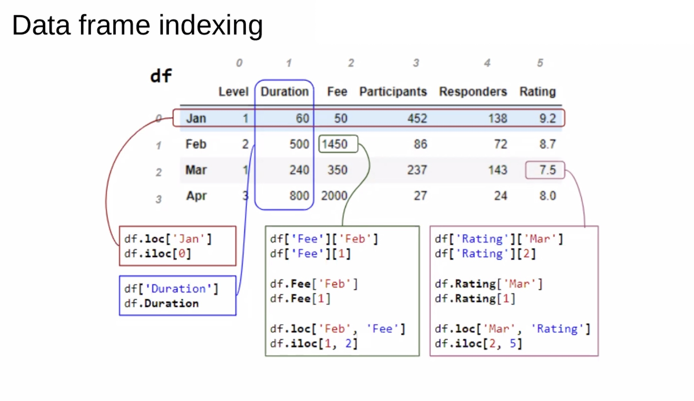

# PyPandaPlayground

A DataFrame Workbench: real [pandas](https://pandas.pydata.org/) running entirely in your browser. Python and pandas are compiled to WebAssembly by [Pyodide](https://pyodide.org/), so there is no server and nothing you open is uploaded anywhere.



## Features

- **Open data** by dropping a file onto the page. Supported formats: CSV, TSV, TXT (delimiter sniffed), JSON, JSON Lines, Excel (`.xlsx`/`.xls`) and Parquet.
- **Browse** any DataFrame with paging, sorting, search and query filters.
- **Inspect** dtypes, per-column profiles and `describe()` summaries.
- **Chart** a frame (bar, histogram, time series and more) with Chart.js.
- **Run Python** against the loaded frames. `pd` and `np` are already imported.
- **Show the code**: loading and exporting a file reports the equivalent pandas call.
- **Export** a frame to CSV, JSON, Excel or Parquet.
- **Sample data**: a generated `orders` dataset (600 rows) is built on start so there is something to explore.

## Running it

It is a single static page. Open `dataframe-workbench.html` in a modern browser, or serve the folder:

```bash
python3 -m http.server 8000
```

Then visit <http://localhost:8000/dataframe-workbench.html>.

The first start downloads about 30 MB (the Pyodide runtime plus pandas and NumPy) from the jsDelivr and cdnjs CDNs. Your browser caches it afterwards. An internet connection is required for that first load.

## Project layout

| File | Purpose |
| --- | --- |
| `dataframe-workbench.html` | The whole app: UI, styles, Pyodide loader and an embedded copy of the engine |
| `core.py` | The Python engine. Every call goes through `dispatch(cmd, json_args)` and returns a JSON string |
| `DataFrameAnatomy.jpg` | Reference diagram of a DataFrame's parts |

### Keeping `core.py` and the HTML in sync

`core.py` is embedded verbatim in the HTML inside `<script type="text/x-python" id="py-core">`. The browser runs the embedded copy, not the file. After editing `core.py`, paste the change into that block as well, or the app will not see it.

### Engine commands

`dispatch` accepts: `frames`, `view`, `save_view`, `info`, `profile`, `describe`, `chart`, `run`, `load`, `export`, `sample`. Each returns `{"ok": true, "result": ...}` or `{"ok": false, "error": "..."}`.

## Versions

- Pyodide 0.27.2
- pandas and NumPy as bundled with that Pyodide release
- Chart.js 4.4.1

## License

[MIT](LICENSE)
